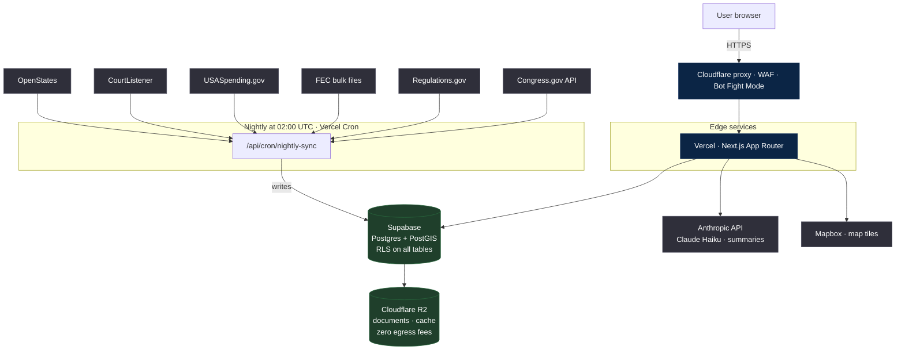

# Civitics

**Civic accountability infrastructure — "Wikipedia meets Bloomberg Terminal for democracy."**

Structured civic data, legislative tracking, public comment submission, connection graph,
maps, and AI-powered accountability tools. Every senator's donor list, every vote on every
bill, every regulation open for public comment — searchable, visualized, and connected in
plain sight.

> **The North Star:** A world map, dark at first. District by district, it gets brighter
> as democratic accountability increases — as officials engage with constituents, as
> promises are kept, as donors and votes are connected in plain sight.
>
> Every feature we build should make that map brighter. If it doesn't, we don't build it.

---

## What's in this repo

Two products sharing one infrastructure:

1. **Civitics App** (`apps/civitics`) — The mission vehicle. Serious civic infrastructure.
   Structured civic data, legislative tracking, public comment submission, connection
   graph, maps, AI accountability tools.
2. **Social App** (`apps/social`) — The distribution vehicle. Censorship-resistant
   platform with the COMMONS token economy. Currently scaffold only.

Both share identity, wallet, and content infrastructure but are kept visually and tonally
separate.

---

## Architecture at a glance



### Monorepo layout

```mermaid
flowchart LR
  subgraph apps["apps/"]
    civitics["civitics<br/>Next.js · the primary product"]
    social["social<br/>Phase 3 · scaffold"]
  end

  subgraph packages["packages/"]
    ui["ui<br/>shared React components"]
    db["db<br/>Supabase clients + types"]
    data["data<br/>ingestion pipelines"]
    graph["graph<br/>D3 force simulation"]
    ai["ai<br/>Claude API service layer"]
    maps["maps<br/>Mapbox + Deck.gl"]
    blockchain["blockchain<br/>ERC-4337 · Phase 4"]
    auth["auth<br/>Supabase Auth + Privy"]
    config["config<br/>ESLint · TS · Tailwind"]
  end

  civitics --> ui
  civitics --> db
  civitics --> graph
  civitics --> ai
  civitics --> maps
  civitics --> auth
  social --> ui
  social --> db
  social --> auth
  data --> db
```

For the deeper technical reference — data model, graph architecture, client rules,
connection types, privacy constraints — see [docs/ARCHITECTURE.md](docs/ARCHITECTURE.md).

---

## Stack

| Layer | Tech |
|---|---|
| Frontend | Next.js 14 (App Router), React, Tailwind, D3.js, Mapbox GL, Deck.gl |
| Backend | Supabase (Postgres + PostGIS + RLS), Next.js Route Handlers |
| AI | Anthropic Claude API (Haiku for summaries, model routing in `packages/ai`) |
| Storage | Cloudflare R2 (zero egress) |
| Hosting | Vercel, Cloudflare proxy |
| Monorepo | Turborepo + pnpm workspaces |

---

## Getting started

Prerequisites: **Node ≥ 20**, **pnpm ≥ 9**, **Supabase CLI**, **Docker Desktop** (for
local Supabase). This project runs on Windows natively; macOS and Linux work equally
well with bash.

```bash
# 1. Install dependencies
pnpm install

# 2. Copy env template and fill in keys
cp .env.example .env.local

# 3. Start local Supabase (Postgres in Docker on 127.0.0.1:54322)
supabase start

# 4. Apply migrations
supabase migration up --local

# 5. Run the app
pnpm dev
# → http://localhost:3000
```

**Before pushing any non-`[skip vercel]` commit:** run `pnpm build` to confirm it
type-checks clean. Vercel uses strict TypeScript and will reject anything that doesn't.

See [CONTRIBUTING.md](CONTRIBUTING.md) for the full workflow, commit conventions, and
PR process.

---

## Documentation map

| File | What's in it |
|---|---|
| [CONTRIBUTING.md](CONTRIBUTING.md) | Setup, commit conventions, PR process |
| [docs/ARCHITECTURE.md](docs/ARCHITECTURE.md) | Technical reference — schema, clients, graph model |
| [docs/API.md](docs/API.md) | Public `/api/*` route reference |
| [docs/ROADMAP.md](docs/ROADMAP.md) | Full phase-by-phase roadmap |
| [docs/ROADMAP_PUBLIC.md](docs/ROADMAP_PUBLIC.md) | Short public-facing roadmap |
| [docs/PHASE_GOALS.md](docs/PHASE_GOALS.md) | Granular phase task tracking |
| [docs/FIXES.md](docs/FIXES.md) | Active backlog — tagged `FIX-NNN` |
| [CLAUDE.md](CLAUDE.md) | Working instructions for Claude Code sessions |

Package-level docs live alongside each package (`packages/*/CLAUDE.md`).

---

## Core principles (non-negotiable)

- **Official comment submission is always free** — no fees, tokens, or credits. Constitutional right.
- **No paywalling civic participation** — reading and submitting positions on government proposals is free forever.
- **Blockchain is invisible** — no seed phrases, wallet addresses, gas fees, or network names in UI.
- **Geography is never stored precisely** — coarsened to district/zip level before any `INSERT`.
- **Platform earns are never extractive** — revenue model aligned with civic mission.
- **Free tier is genuinely powerful** — covers 90% of citizen needs.

---

## License

Source is available for review and contribution. Licensing terms for production reuse
are being finalized alongside the Phase 2 institutional API launch. If you want to
build on top of Civitics, open an issue and we'll talk.
